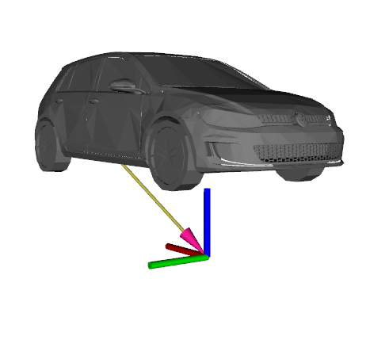
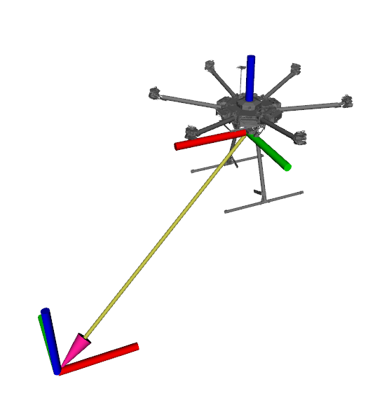

# 3D Markers for Rviz

## Overview
This is a collection of low-poly 3D markers that can enhance data visualisation using Rviz. The 3D models are designed to be lightweight without heavily compromising realisticity.

## Installation

1. Clone this repository to your catkin workspace
2. Build the package
`cd catkin_ws`
`catkin build rviz_markers`
3. Go to root folder and source your workspace
`source catkin_ws/devel/setup.bash`

## Usage

The package currently contains two markers. 
### VW E-Golf
Using the VW E-Golf marker:
1. In a terminal window, start roscore
`roscore`
2. In a different terminal window, run:
`rosrun rviz_markers egolf`
3. The marker should be visible using Rviz, as Marker. 

### DJI Matrice 600 Pro Drone
Using the DJI Matrice 600 Pro Drone marker:
1. In a terminal window, start roscore
`roscore`
2. In a different terminal window, run:
`rosrun rviz_markers drone`
3. The marker should be visible using Rviz, as Marker. 

## Topics
### VW E-Golf
Parameters of the published topic:
* Name: */egolf_3d/egolf_marker*
* Type: *visualisation_msgs/Marker*
* Fixed frame: *base_link*

### DJI Matrice 600 Pro Drone
Parameters of the published topic:
* Name: */drone_3d/drone_marker*
* Type: *visualisation_msgs/Marker*
* Fixed frame: *drone/os1_sensor*

